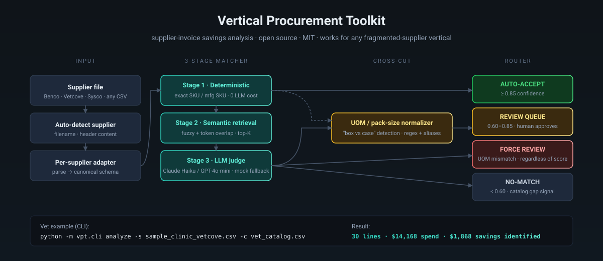
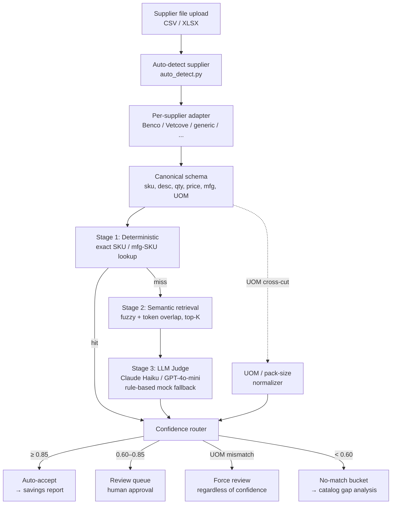

# Vertical Procurement Toolkit

<p align="center">
  
</p>

[](https://github.com/abhinaykrupa/vertical-procurement-toolkit/actions/workflows/ci.yml)
[](https://opensource.org/licenses/MIT)
[](https://www.python.org/downloads/)
[](https://sourceclub-poc.streamlit.app/)

**An open-source reference architecture for automating supplier-invoice savings analysis in fragmented-supplier industries.**

Small businesses in dental, veterinary, optometry, HVAC, auto repair, independent restaurants, and similar verticals all face the same problem: they buy from 3–7 different distributors, every distributor uses different SKUs, different descriptions, different pack sizes, different units of measure — and nobody has time to compare line-by-line whether they're overpaying.

This repo is the engine that does that comparison automatically. It was originally built as a case study for a dental Group Purchasing Organization, but the architecture is vertical-agnostic — swap the catalog and add a supplier adapter, and the same engine works for any fragmented-supplier vertical.

**Five verticals ship with working examples today** — same engine, zero matcher changes:

| Vertical | Adapter | Sample export | Result on bundled sample |
|---|---|---|---|
| 🦷 Dental | Benco, Henry Schein, Darby, Base86, Patterson | 6 files | match + savings report |
| 🐾 Veterinary | Vetcove (multi-distributor) | 1 file | 30 lines · $14.2K spend · **$1.9K savings** |
| 🔧 HVAC | Ferguson | 1 file | 30 lines · $64.8K spend · **$10.4K savings** · 1 catalog gap |
| 🍽️ Restaurant | Sysco | 1 file | 30 lines · $74.8K spend · **$8.2K savings** |
| 👓 Optometry | VSP/Essilor | 1 file | 30 lines · $98.8K spend · **$12.3K savings** · 1 catalog gap |

**Live demo (all 5 verticals):** `https://vertical-procurement-toolkit.streamlit.app` ← deploy instructions below

## Try it in 30 seconds

```bash
pip install pandas PyYAML
git clone https://github.com/abhinaykrupa/vertical-procurement-toolkit
cd vertical-procurement-toolkit

# Run a vet-vertical savings analysis end-to-end (CLI, no UI needed)
python -m vpt.cli analyze \
  -s sample_data/sample_clinic_vetcove.csv \
  -c sample_data/vet_catalog.csv --pretty | head -40

# Or boot the Streamlit UI for the dental example
pip install streamlit plotly reportlab
streamlit run app/main.py
```

---

## What's inside

```
vpt/                            Public Python package — clean import surface
  __init__.py                   from vpt import match_invoice, get_adapter, load_catalog
  cli.py                        `python -m vpt.cli analyze ...`
  generic_adapter.py            Column-mapped CSV adapter (any vertical, zero adapter code)
  llm_judge.py                  Real Anthropic / OpenAI Stage-3 judge (mock fallback)
  uom.py                        Per-vertical UOM table loader

app/
  main.py                       Streamlit reference UI (dental example)
  engine/
    matcher.py                  3-stage matching engine + UOM/pack-size normalizer
    adapters/
      benco.py                  Dental — per-supplier parsers
      henry_schein.py
      darby.py
      base86.py
      patterson.py              Handles deliberately messy real-world export
      vetcove.py                Veterinary — multi-distributor order history
      ferguson.py               HVAC — Ferguson supply export
      sysco.py                  Restaurant — Sysco foodservice export
      vsp.py                    Optometry — VSP/Essilor order export
      auto_detect.py            Supplier auto-detection
  sync/                         Mock Stripe ↔ HubSpot billing rollup (multi-location example)

uom_tables/                     Per-vertical UOM vocabulary (YAML)
  dental.yaml, vet.yaml, hvac.yaml, restaurant.yaml, optometry.yaml

sample_data/
  sourceclub_catalog.csv        Dental reference catalog
  vet_catalog.csv               Veterinary reference catalog (~30 SKUs)
  hvac_catalog.csv              HVAC reference catalog (~30 SKUs)
  restaurant_catalog.csv        Restaurant/foodservice reference catalog (~30 SKUs)
  *_<supplier>.csv              Sample supplier exports (4 verticals)

tests/                          Pytest suite — 40 tests
.github/workflows/ci.yml        GitHub Actions CI (3.10 / 3.11 / 3.12)
ADAPTING.md                     ← Read this to adapt to your vertical
CONTRIBUTING.md                 How to contribute (new adapters, verticals, fixes)
CHANGELOG.md                    Versioned changes
case-study/                     Original SourceClub case-study deliverables (preserved as-is)
```

## The architecture



The **3 stages exist because the failure modes are different.** Stage 1 catches the easy 30–40% (clean SKU matches) at zero LLM cost. Stage 2 narrows the candidate space. Stage 3 is where reasoning happens (UOM normalization, manufacturer disambiguation).

The **UOM / pack-size normalizer** is the actual hard problem. "Box of 100" vs "case of 10 boxes" matters more than fuzzy description scoring — the unit-economics math breaks otherwise. This is its own concern in the architecture and runs cross-cut to the 3 stages.

---

## Deploy your own demo (10 minutes)

1. Fork this repo on GitHub
2. Go to [share.streamlit.io](https://share.streamlit.io) → **New app**
3. Select your fork → branch `main` → main file path `app/main.py`
4. Click **Deploy** — that's it. The demo shows all 5 verticals in the dropdown.

No API keys required. Runs fully offline on bundled sample data.

---

## Quick start

Requires Python 3.10+.

```bash
git clone https://github.com/abhinaykrupa/vertical-procurement-toolkit.git
cd vertical-procurement-toolkit
python3 -m venv .venv
.venv/bin/pip install -r requirements.txt
.venv/bin/streamlit run app/main.py
```

Opens at `http://localhost:8501`. Pick any sample file from the dropdown to see the pipeline run end-to-end.

---

## Honest match rates

Run `python scripts/benchmark.py` to reproduce. Real numbers on the bundled samples:

| Vertical | Adapter | Lines | Auto% | Review% | No-match% | Savings found |
|---|---|---|---|---|---|---|
| Dental | Benco | 34 | 94% | 0% | 6% | $5,119 (41%) |
| Dental | Henry Schein | 38 | 92% | 0% | 8% | $3,927 (50%) |
| Dental | Darby | 26 | 50% | 42% | 8% | $4,312 (46%) |
| Dental | Base86 | 28 | 11% | 64% | 25% | $4,783 (37%) |
| Dental | Patterson (messy) | 25 | 8% | 48% | 44% | $2,752 (23%) |
| Vet | Vetcove | 30 | 100% | 0% | 0% | $1,868 (13%) |
| HVAC | Ferguson | 30 | 97% | 0% | 3% | $10,411 (16%) |
| Restaurant | Sysco | 30 | 100% | 0% | 0% | $8,171 (11%) |
| Optometry | VSP/Essilor | 30 | 97% | 0% | 3% | $12,310 (12%) |

The spread is the point. Files with clean manufacturer SKUs (Benco, Vetcove) auto-accept at 90-100%. Files with no mfg SKUs and messy formatting (Patterson) drop to 8% auto-accept and 44% no-match — and that's **correct behavior**, not failure. The no-match bucket feeds catalog-gap analysis, and the review queue catches the ambiguous middle. Human-in-the-loop is the spec.

## Use it programmatically or via CLI

```python
from vpt import match_invoice, load_catalog, get_adapter

catalog = load_catalog("sample_data/vet_catalog.csv")
parse = get_adapter("Vetcove")
invoice = parse(open("sample_data/sample_clinic_vetcove.csv", "rb").read(), "vetcove.csv")
results = match_invoice(invoice, catalog)
print(results[["sc_sku", "status", "confidence", "total_savings"]].head())
```

CLI equivalent:

```bash
# Auto-detect supplier, output JSON
python -m vpt.cli analyze -s invoice.csv -c catalog.csv --pretty

# Use the generic adapter for an unknown CSV (no per-supplier adapter needed)
python -m vpt.cli analyze -s mystery.csv -c catalog.csv \
  --adapter generic \
  --map supplier_sku=ItemNum raw_description=ProductName quantity=Qty unit_price=Price
```

Real LLM for Stage 3 (optional):

```bash
export LLM_JUDGE_PROVIDER=anthropic  # or 'openai'
export ANTHROPIC_API_KEY=sk-...
# Engine now uses Claude for ambiguous matches; mock is used when keys absent.
```

Real embeddings for Stage 2 (optional):

```bash
pip install sentence-transformers
export STAGE2_RETRIEVAL=embeddings
# Stage 2 now retrieves candidates by semantic similarity (all-MiniLM-L6-v2)
# instead of difflib. Falls back to difflib automatically if the package is
# absent, so the zero-dep demo never breaks.
```

## Adapt it to your vertical

The bundled example is dental supply (Benco, Henry Schein, Darby, Base86, Patterson). To run it against vet supply (Patterson Vet, Covetrus, MWI), HVAC (Ferguson, Carrier, Trane), restaurant supply (Sysco, US Foods, PFG), or any other vertical:

**Read [ADAPTING.md](./ADAPTING.md).** It's a ~10-minute walkthrough covering:

1. Swap the catalog CSV
2. Add a supplier adapter (template provided — look at [`app/engine/adapters/benco.py`](./app/engine/adapters/benco.py))
3. Tweak the UOM regex table for your industry's vocabulary
4. Register the new adapter in `auto_detect.py`

That's it. Same engine, new vertical.

---

## Tech choices and why

| Choice | Why |
|---|---|
| **Streamlit** | Fastest path to a runnable demo. Pure Python. Anyone can install and run in 2 minutes. |
| **Plotly** | Looks like a real product. Works inside Streamlit with zero config. |
| **reportlab** | Pure Python, no system deps. Generates real branded PDFs. |
| **Pandas only for matching** | No vector DB needed for the POC. Deterministic + fuzzy + token-overlap gets 70–85% match rate on representative data. |
| **Mocked LLM** | Demo runs offline, zero setup. Architecture is API-ready — swap one function. Production prompt sketch is in the code. |
| **MIT License** | Build on it freely. Fork it. Ship it. |

---

## Production-readiness gaps (intentionally out of POC scope)

The repo is a runnable reference architecture, not production code. For a production deployment, you'd need:

- Real vector store (pgvector + sentence-transformers) replacing fuzzy matching in Stage 2
- Real LLM API calls (Claude Haiku / GPT-4o-mini) for Stage 3
- Authentication, multi-tenant isolation, audit log per matching decision
- Background job queue for batch ingestion
- Persistent review queue with state (POC buttons are illustrative)
- Catalog versioning so historical reports remain reproducible

[PRODUCTION_ARCHITECTURE.md](./PRODUCTION_ARCHITECTURE.md) covers the full production stack — vendor picks, cost model, build path.

---

## Documentation

| Doc | What |
|---|---|
| [examples/quickstart.md](./examples/quickstart.md) | Copy-pasteable CLI / Python API / generic-adapter walkthroughs |
| [ADAPTING.md](./ADAPTING.md) | Adapt this toolkit to your vertical (~30 min walkthrough) |
| [CONTRIBUTING.md](./CONTRIBUTING.md) | How to contribute (new adapters, verticals, fixes) |
| [ROADMAP.md](./ROADMAP.md) | What's planned, what's accepted, what's out of scope |
| [CHANGELOG.md](./CHANGELOG.md) | Versioned changes |
| [SECURITY.md](./SECURITY.md) | Vulnerability disclosure policy |
| [SECURITY_REVIEW.md](./SECURITY_REVIEW.md) | POC-vs-production security gap analysis |
| [PRODUCTION_ARCHITECTURE.md](./PRODUCTION_ARCHITECTURE.md) | Production deployment guidance (pgvector, real LLM, auth, audit log) |
| [case-study/](./case-study/) | Original SourceClub case-study deliverables (origin story) |

## Contributing

This repo is meant to grow. The fastest contributions:

- **Add a supplier adapter** for your vertical (vet, HVAC, restaurant, auto, etc.)
- **Add a sample export file** + catalog for a new vertical
- **Improve the UOM normalizer** for your industry's pack-size vocabulary
- **Wire in a real LLM call** for Stage 3 behind a feature flag

See [CONTRIBUTING.md](./CONTRIBUTING.md) for the process. Open issues are tagged `good first issue` if you want a starter task.

---

## Original context

This repo started as a case-study deliverable for the Head of AI Powered Operations role at **SourceClub** (a dental GPO). The original case-study docs are preserved in [`case-study/`](./case-study/) — they're a useful read if you want to see how the architecture was justified to a business audience:

- [`case-study/SUBMISSION.md`](./case-study/SUBMISSION.md) — full written deliverable
- [`case-study/STRATEGIC_ADDENDUM.md`](./case-study/STRATEGIC_ADDENDUM.md) — six-quarter growth thesis
- [`case-study/VIDEO_SCRIPT.md`](./case-study/VIDEO_SCRIPT.md) — 3–5 min demo walkthrough script
- [`case-study/SUBMISSION_EMAIL.md`](./case-study/SUBMISSION_EMAIL.md) — recruiter email
- [`case-study/assignments.md`](./case-study/assignments.md) — original case-study brief

---

## License

[MIT](./LICENSE) — build on it freely.
